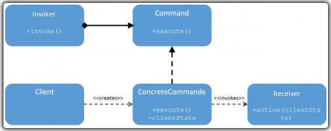
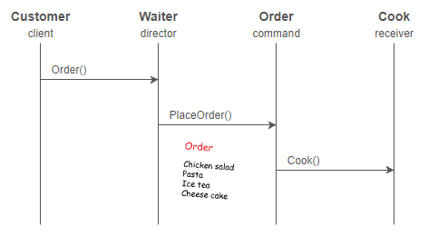

# Son but ?

Ce pattern répond au besoin d’émettre des requêtes sur des objets sans ne rien connaitre des opérations nécessaires ou du destinataire. Pour cela nous utilisons l’encapsulation des requêtes.

_Petit rappel :_ l’encapsulation consiste à cacher l'implémentation de l'objet, en empêchant l'accès aux données par un autre moyen que les services proposés. L'encapsulation permet donc de garantir l'intégrité des données contenues dans l'objet.

Comme vous l’aurez compris ce pattern a, tout d’abord, un but de sécurité dans les applications. Plus encore, ce pattern permet de supprimer toutes duplications de code, d’avoir une meilleure maintenance du code mais a aussi quelques fonctionnalités sympathiques que nous verrons à la fin de la présentation.

# Son implémentation ?

Ça peut paraitre un peu barbare comme diagramme mais nous allons voir par la suite que le principe est très facile à comprendre.

Détaillons ce pattern :
-	Le client va déclencher une requete, role _d'invocator_
-	A cette action est associé une commande, une _concreteCommande_ implémentant l'interface _Commande_,
-	La _concrete commande_ va declencher l'action de l'objet, declenché la méthode de l'objet associée, il est le _receiver_.

**A detailler plus !**

# Parce qu'un exemple vaut mieux qu'un long discours...

**Sans pattern command :** 
Le client commande une salade composée. Il crée une nouvelle assiette, sur laquelle il exécute les méthodes : addSalade(), addPate() et addPoulet().

**Avec le pattern command :**
Le client actionne l’Invocator de la salade césar (un bouton souvent).
La ConcreteCommande « PreparerSaladeCesar » est exécutée et crée une nouvelle assiette.
Puis cette CC va invoquer les méthodes addSalade(), addPate() et addPoulet() de l’assiette.

Ainsi, on voit clairement l’encapsulation ici, où le client n’a pas connaissance ; ni de l’objet assiette, ni des méthodes qui lui sont appliquées.

